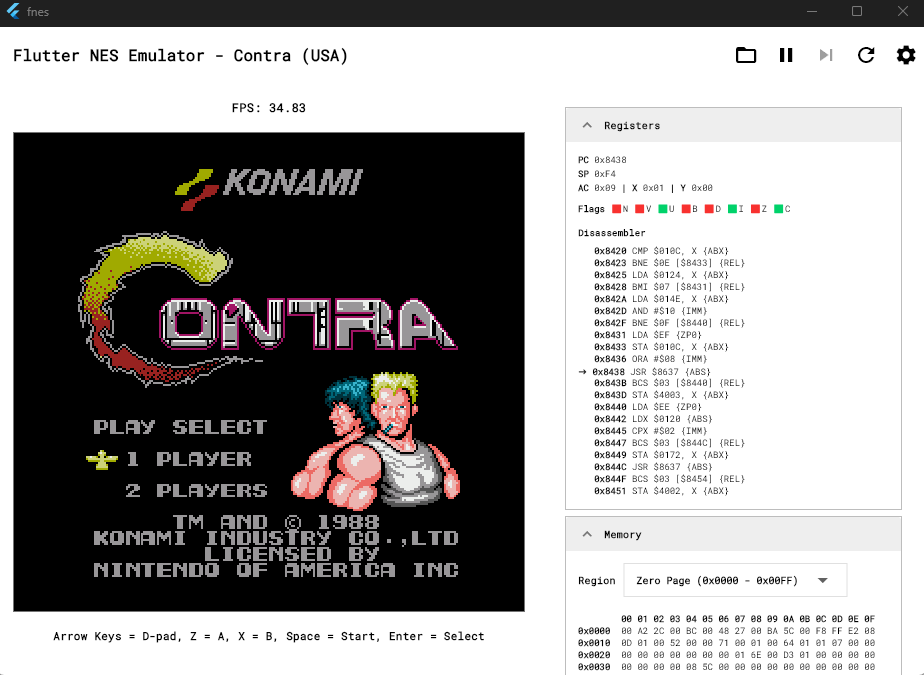
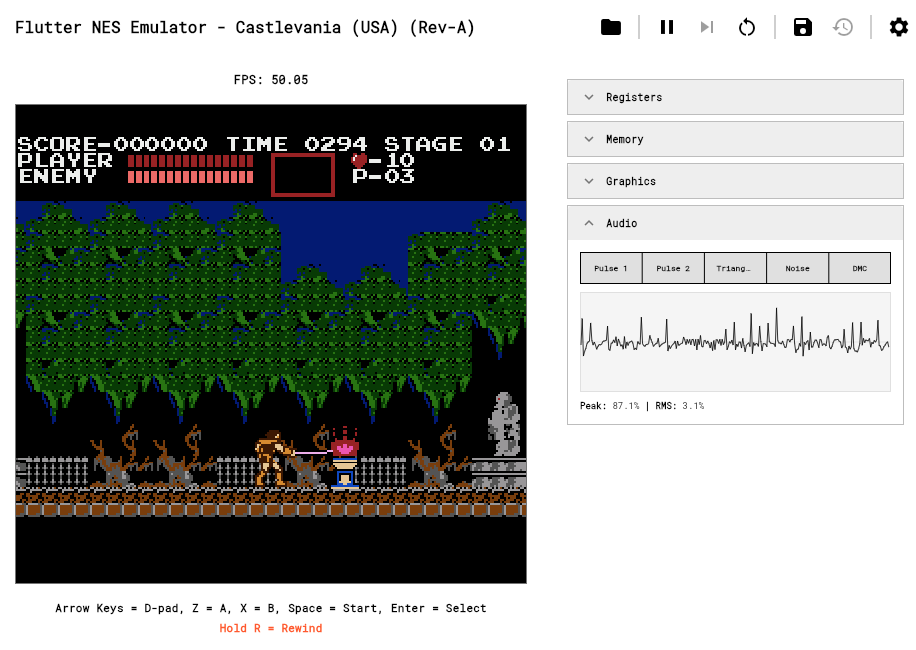
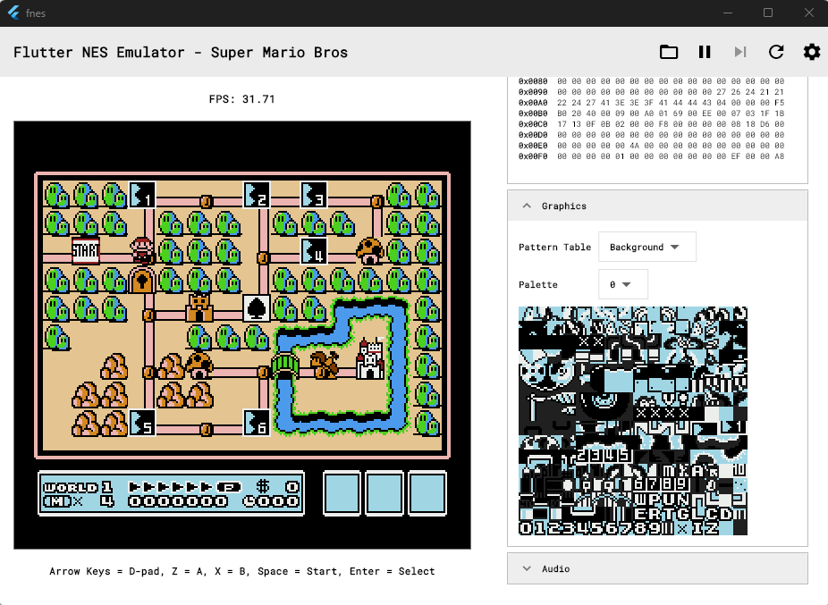
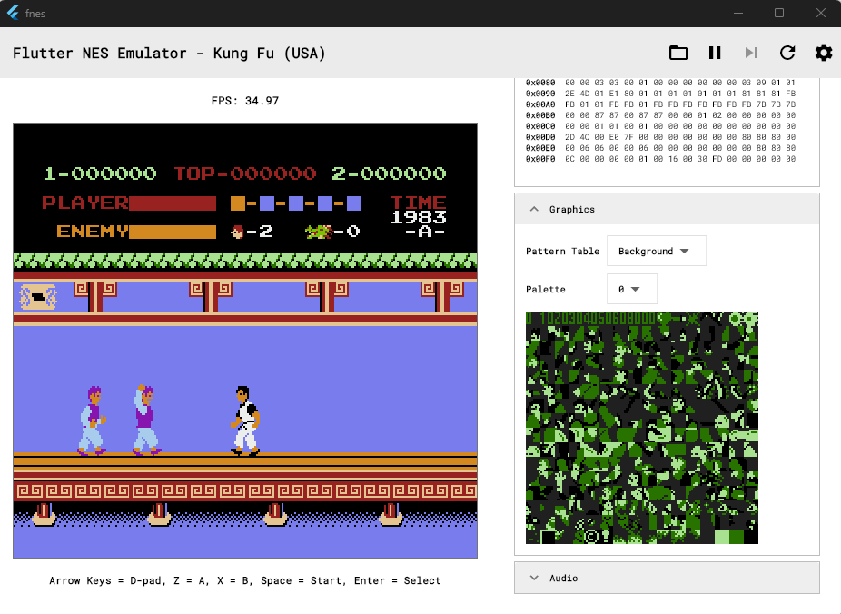
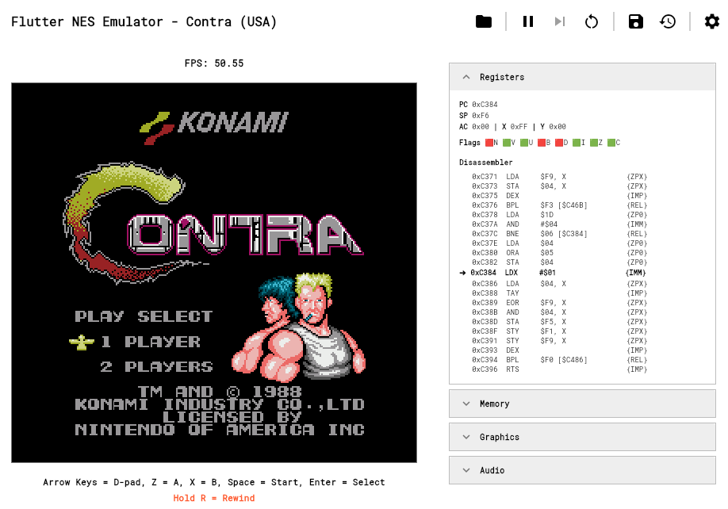
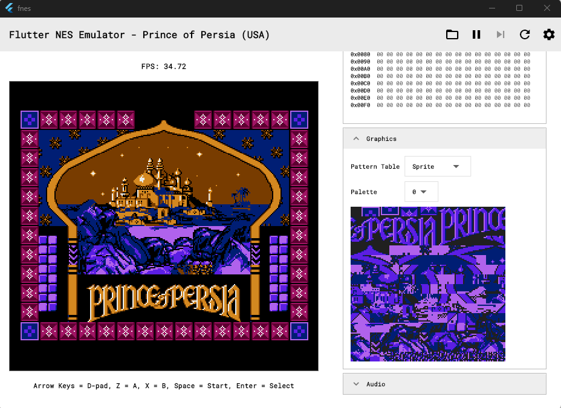
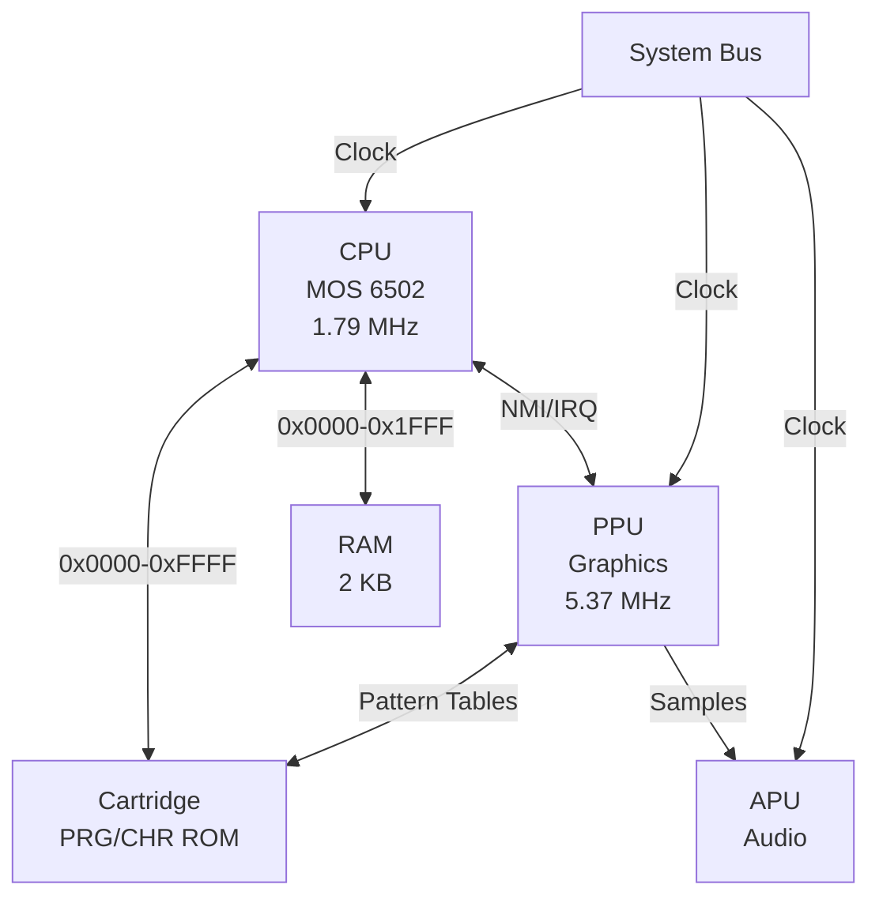
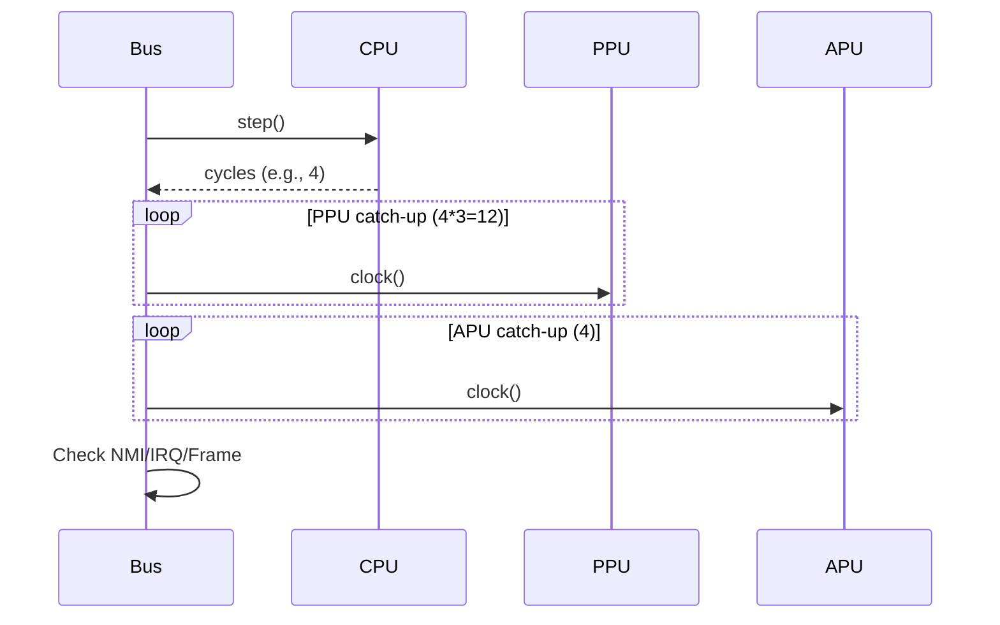

# fnes - NES Emulator in Dart & Flutter

Cycle-accurate Nintendo Entertainment System emulator in Dart with Flutter UI. Implements MOS 6502 CPU, PPU, APU, and cartridge mappers.

## Features

- MOS 6502 CPU with 151 instructions
- PPU scanline rendering
- 5-channel APU audio
- Cartridge mappers (MMC1, MMC3, UxROM, etc.)
- Zapper light gun support
- Save states with rewind
- Game Genie cheats
- Event-based architecture
- NTSC/PAL support

## Screenshots

|                                                 |                                                 |
| :---------------------------------------------: | :---------------------------------------------: |
|  |  |
|  |  |
|  |  |

## System Architecture

Components communicate through a shared memory bus. Each hardware component operates on its own clock cycle, synchronized through the system clock.



### Memory Map

CPU address space (64 KB):

```
0x0000 - 0x1FFF (8 KB)   Internal RAM (mirrored 4x)
0x2000 - 0x3FFF (8 KB)   PPU Registers (mirrored)
0x4000 - 0x4017 (24 B)   APU & I/O Registers
0x4018 - 0x401F (8 B)    Test/Expansion Port
0x4020 - 0x5FFF (8 KB)   Cartridge Expansion ROM
0x6000 - 0x7FFF (8 KB)   Cartridge SRAM (Battery Backed)
0x8000 - 0xFFFF (32 KB)  Cartridge PRG ROM
```

## Execution Pipeline

`Bus.runFrame()` executes the main loop:

1. CPU executes one instruction (2-7 cycles)
2. PPU catches up (3x CPU cycles for NTSC, 3.2x for PAL)
3. APU catches up (1x CPU cycles)
4. Check for NMI/IRQ/frame completion
5. Handle DMA transfers (stalls CPU for 513 cycles)

`_cpuClockAccumulator` handles fractional PPU timing.



### Instruction Execution

CPU executes 151 MOS 6502 instructions:


Addressing modes: Implied, Accumulator, Immediate, Zero Page, Zero Page X/Y, Absolute, Absolute X/Y, Indirect, Indirect X, Indirect Y, Relative.

## Component Details

### CPU - MOS 6502

Executes at 1.79 MHz with registers A, X, Y, SP, PC and flags C, Z, I, D, B, V, N.

- Character movement and collision
- Game state management
- Input processing
- Sprite and background management instructions

### PPU - Picture Processing Unit

The PPU operates at 5.37 MHz (3x CPU) and manages video rendering. Its memory is separate from CPU RAM:

- **Nametable VRAM (2 KB)**: `tableData` - stores tile IDs (256x240 / 8x8 per tile)
- **OAM (256 bytes)**: `pOAM` - sprite metadata (Y pos, tile ID, attrib, X pos per sprite)
- **Pattern Tables (4 KB CHR)**: Fetched from cartridge - bitmap data for 256 unique tiles
- **Palette Tables (32 bytes)**: `paletteTable` - 8 palettes for background, 8 for sprites

The PPU also maintains internal state:

- **Scroll position** (X/Y): via `LoopyRegister` for viewport control
- **Shifters**: `backgroundShifterPatternLow/High`, `backgroundShifterAttribLow/High`
- **Sprite buffers**: `spriteShifterPatternLow/High` for 8 sprites per scanline

#### Rendering Pipeline

The PPU renders the display line-by-line using a scanline-based approach. On each of 262 scanlines (341 cycles per line):

**Visible Scanlines (0-239)**:

- PPU.cycle increments 0-340 each PPU clock
- At cycles 1-256: nametable and pattern data fetching, pixel rendering to `screenPixels[scanline][cycle-1]`

### PPU - Picture Processing Unit

Renders 256x240 frames at 60Hz (NTSC). Each scanline is 341 PPU cycles. Frame structure:

- Scanlines 0-239: Visible rendering
- Scanline 240: Post-render idle
- Scanlines 241-260: VBlank (NMI triggered at start of 241)
- Scanline 261: Pre-render

Per scanline:

- Cycles 1-256: Fetch tiles, render pixels
- Cycles 257-320: Sprite evaluation, load OAM
- Cycles 321-340: Prefetch next scanline

Rendering pipeline: Read nametable → Fetch pattern data → Apply palette → Evaluate sprites → Check priority → Write pixel.

PPU handles sprite evaluation, priority (background vs sprite), and palette selection (8 palettes, 16 colors each).

#### NMI - Non-Maskable Interrupt

PPU triggers NMI at scanline 241 (VBlank start). CPU can safely update OAM and VRAM during VBlank without visual artifacts.

### Audio Processing Unit

APU generates audio via 5 channels:

- **Pulse 1/2**: Duty cycle waveforms (12.5%, 25%, 50%, 75%)
- **Triangle**: Fixed 16-level waveform
- **Noise**: Pseudo-random noise generator
- **DMC**: Delta modulation sample playback

Each channel has envelope generator, length counter. Pulse channels have frequency sweep.

APU runs at CPU speed. Samples buffer to Flutter audio output.

### Cartridge System

Cartridge reads iNES format ROM:

**iNES header (16 bytes)**:

- Byte 4: PRG ROM size (16KB units)
- Byte 5: CHR ROM size (8KB units)
- Byte 6-7: Mapper ID
- Byte 8: SRAM size, mirroring mode

- `_programMemory`: PRG ROM (program code, 16 KB \* programBanks)
- `_charMemory`: CHR ROM (graphics, 8 KB \* charBanks) OR 8 KB CHR RAM if charBanks == 0
- `_mapper`: Mapper instance for bank switching and advanced features
- `_hwMirror`: Hardware mirroring mode (horizontal/vertical)

#### Cartridge Mirroring

NES cartridges support different mirroring modes for background VRAM:

- **Horizontal**: Left/right tiles mirror vertically (for horizontal scrolling)
- **Vertical**: Top/bottom tiles mirror horizontally (for vertical scrolling)
- **One-Screen Low**: All tiles map to first 1 KB of VRAM
- **One-Screen High**: All tiles map to second 1 KB of VRAM
- **Hardware**: Cartridge controls mirroring (typically used by advanced mappers)

### Mapper Architecture

Mappers handle bank switching and memory management. They intercept CPU/PPU memory accesses for:

- PRG/CHR ROM bank switching
- IRQ generation (scanline counters)
- Nametable mirroring control
- SRAM write protection

Implemented mappers:

- **000 (NROM)**: No bank switching (32KB max)
- **001 (SxROM/MMC1)**: Bank switching and mirroring
- **002 (UxROM)**: PRG bank switching
- **003 (CNROM)**: CHR bank switching
- **004 (TxROM/MMC3)**: Scanline IRQs and advanced banking
- **007 (AxROM)**: Single bank with mirroring
- **066 (GxROM)**: PRG and CHR bank switching

## Emulation Flow

NES frame = 262 scanlines = 29,781 CPU cycles:

- Scanlines 0-239: Visible rendering
- Scanline 240: Post-render idle
- Scanlines 241-260: VBlank (NMI at start)
- Scanline 261: Pre-render

NTSC: 59.73 FPS.

### CPU-PPU Communication

CPU accesses PPU through memory-mapped registers at `0x2000-0x3FFF`. PPU updates VRAM during writes and triggers NMI at VBlank.

## Project Structure

Core implementation:

- `lib/components/` - Hardware components (CPU, PPU, APU, bus, cartridge)
- `lib/mappers/` - Cartridge mapper implementations (MMC1, MMC3, UxROM, etc.)
- `lib/controllers/` - Emulation controller and state management
- `lib/core/` - Event system infrastructure
- `lib/widgets/` - Flutter UI and debug panels
- `docs/` - Architecture documentation

Key files:

- `lib/core/event.dart` - EventBus and subscription management
- `lib/core/emulator_events.dart` - Event type definitions (43 events)
- `lib/components/cpu.dart` - MOS 6502 with 151 instructions
- `lib/components/ppu.dart` - Scanline renderer with sprite evaluation
- `lib/components/apu.dart` - 5-channel audio synthesis
- `lib/components/bus.dart` - Memory routing and clock synchronization

## Key Implementation Details

### Event System

Components dispatch 43 event types across 11 categories:

- ROM loading and lifecycle
- Emulation state (start, pause, reset)
- Frame rendering with timing metrics
- Hardware events (interrupts, VBlank, DMA)
- Input events (controller, Zapper)
- Save states
- Errors and warnings

EventBus dispatches events synchronously with 5 priority levels. Subscribers can filter by event type and priority.

### Timing and Synchronization

`Bus.runFrame()` executes CPU instructions until a frame completes. CPU executes one instruction (2-7 cycles), then PPU and APU catch up for the same number of cycles.

Clock ratios:

- NTSC: PPU runs at 3.0x CPU speed (5.37 MHz vs 1.79 MHz)
- PAL: PPU runs at 3.2x CPU speed

Fractional PPU cycles accumulate in `_cpuClockAccumulator` for precise timing.

### Memory Routing

CPU memory access is routed through `Bus.cpuRead()` and `Bus.cpuWrite()`:

- `0x0000-0x1FFF`: Internal 2KB RAM (mirrored 4 times)
- `0x2000-0x3FFF`: PPU registers (8 bytes, mirrored)
- `0x4000-0x4017`: APU and I/O registers
- `0x4016-0x4017`: Controller input
- `0x4020-0xFFFF`: Cartridge ROM via mapper

### Interrupts

Bus checks for interrupts before each CPU step:

- **NMI**: Triggered by PPU VBlank. Vector at `0xFFFA`. Cannot be masked.
- **IRQ**: Triggered by mapper or APU. Vector at `0xFFFE`. Masked by CPU I flag.

### Mappers

Cartridge mappers handle bank switching and memory mapping. All mappers extend the abstract `Mapper` class:

```dart
int? cpuMapRead(int address)
int? cpuMapWrite(int address, int data)
int? ppuMapRead(int address)
int? ppuMapWrite(int address)
```

Implemented mappers include NROM, MMC1, UxROM, CNROM, MMC3, and others.

### PPU Registers

Mapped at `0x2000-0x3FFF` (mirrored every 8 bytes):

- `0x2000` PPUCTRL - Nametable select, increment mode, NMI enable
- `0x2001` PPUMASK - Rendering enable, sprite/background visibility
- `0x2002` PPUSTATUS - VBlank flag, sprite 0 hit, sprite overflow (read clears latch)
- `0x2003` OAMADDR - OAM address pointer
- `0x2004` OAMDATA - OAM read/write
- `0x2005` PPUSCROLL - Scroll position (write twice: X then Y)
- `0x2006` PPUADDR - VRAM address (write twice: high then low byte)
- `0x2007` PPUDATA - VRAM read/write

## Demo

Live demo: [https://hamed-rezaee.github.io/fnes/](https://hamed-rezaee.github.io/fnes/)

## Getting Started

```sh
git clone https://github.com/hamed-rezaee/fnes.git
cd fnes
flutter pub get
flutter run
```

## License

MIT License - see [LICENSE](LICENSE) file.
