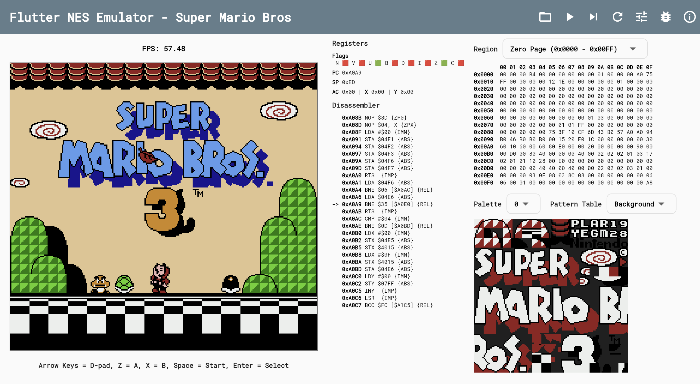
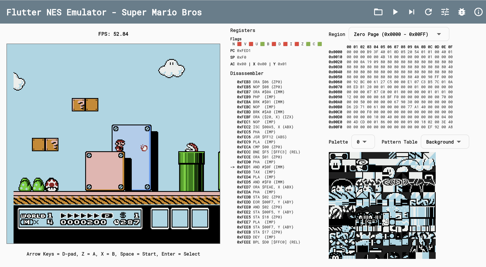
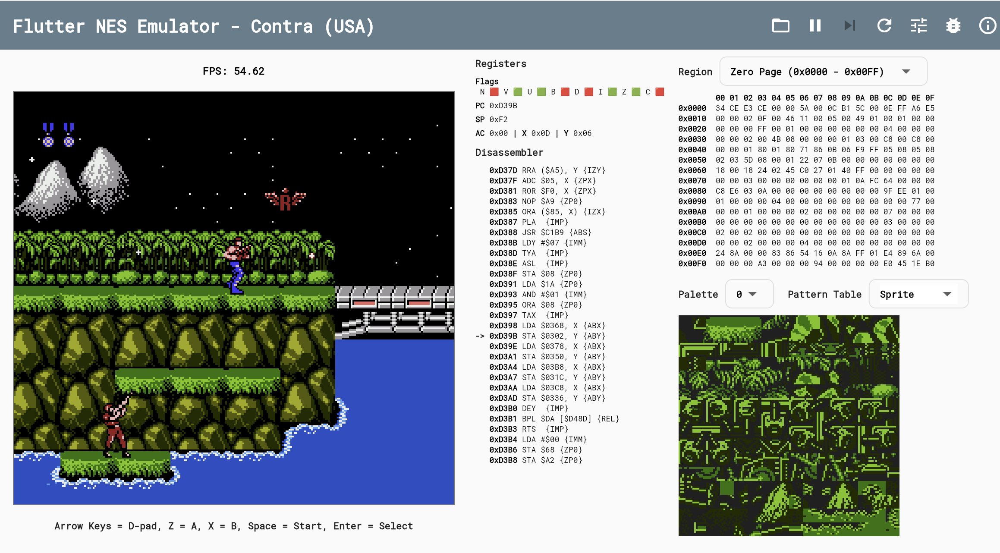
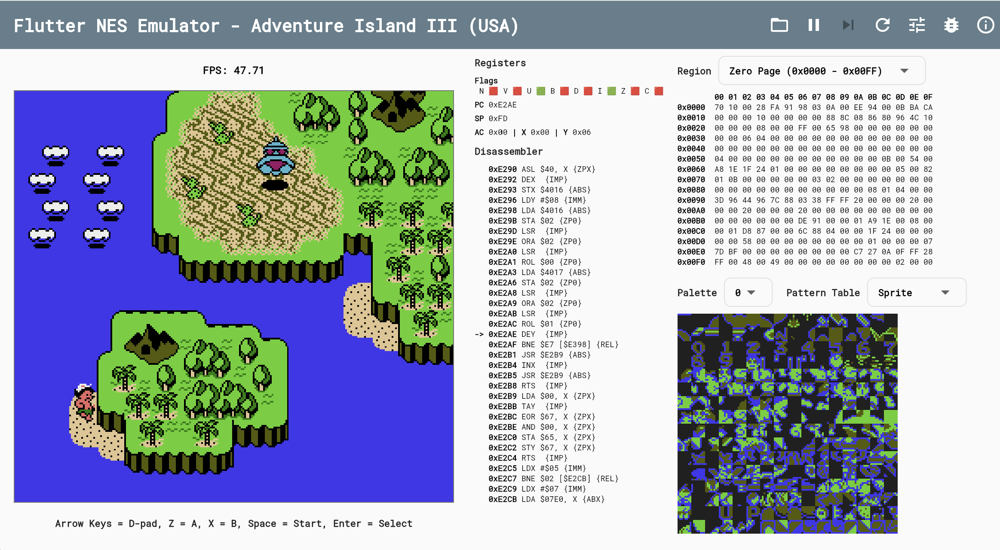
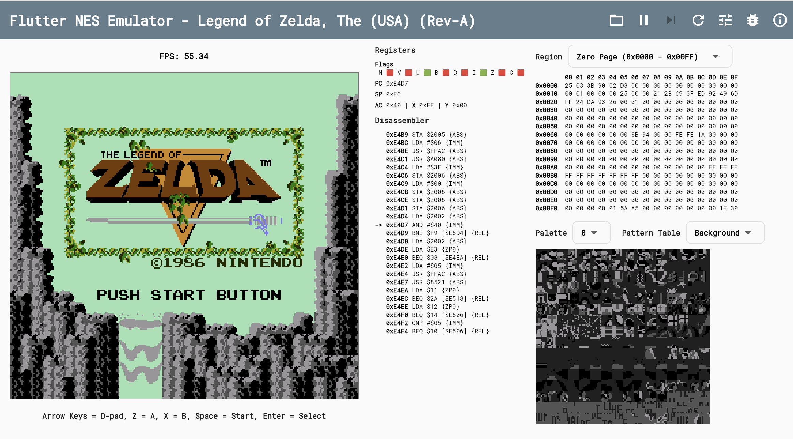
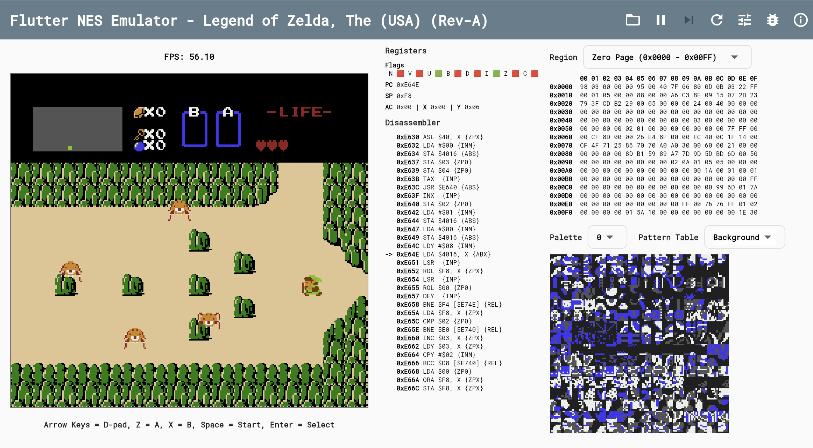

# fnes - A NES Emulator in Dart & Flutter

This project is a Nintendo Entertainment System (NES) emulator written entirely in Dart, with a user interface built using Flutter. It aims to replicate the hardware of the original NES to play classic games.

## Architecture

The emulator's architecture is designed to mirror the hardware components of the original NES. The core components are decoupled and communicate with each other through a central bus.

```
+-----------------+      +------------------+      +-----------------+
|       CPU       |<---->|    System Bus    |<---->|    Cartridge    |
| (MOS 6502)      |      | (CPU/PPU Memory) |      | (PRG/CHR ROM)   |
+-----------------+      +------------------+      +-----------------+
        ^                      ^      ^
        |                      |      |
        |                      |      |
+-----------------+      +-----+------+-----+      +-----------------+
|       PPU       |<---->|      DMA         |<---->|   Controllers   |
| (Picture Unit)  |      |   (OAM/SPR)      |      |   (Input)       |
+-----------------+      +------------------+      +-----------------+
        |                      ^
        |                      |
+-----------------+      +-----+------+
|     Display     |      |     APU    |
| (Flutter UI)    |      | (Sound)    |
+-----------------+      +------------+

```

## How it Works

The emulation runs in a continuous loop, driven by the CPU. Here's a simplified breakdown of the process:

1.  **Initialization:** The `NES` class initializes all hardware components: the CPU, PPU, and the system bus. A game cartridge (ROM) is loaded, and its data is mapped into the CPU's address space by the appropriate Mapper.
2.  **CPU Cycle:** The CPU fetches an instruction from memory (via the bus), decodes it, and executes it. This might involve reading/writing data from RAM, the PPU, or the cartridge.
3.  **PPU Cycle:** For every CPU cycle, the PPU executes three cycles. The PPU is responsible for what appears on the screen. It reads pattern tables and palette data to render backgrounds and sprites.
4.  **Synchronization:** The CPU and PPU run in parallel and must be synchronized. The PPU generates a Non-Maskable Interrupt (NMI) at the beginning of the vertical blanking interval (V-blank), signaling the CPU that it's safe to update graphics data without causing visual artifacts.
5.  **Rendering:** The PPU renders one scanline at a time. Once a full frame is rendered, the resulting image data is sent to the Flutter UI to be displayed on the screen.

## Components

The project is organized into the following directories:

- **`lib/components/`**: Contains the core hardware components of the emulator.

  - `nes.dart`: The main `NES` class that orchestrates the entire emulator, managing the main loop and the interaction between components.
  - `cpu.dart`: An implementation of the MOS Technology 6502 processor. It fetches and executes instructions, manipulating data in memory and controlling the other components.
  - `ppu.dart`: The Picture Processing Unit, responsible for everything related to graphics. It renders the background and sprites, manages palettes, and generates the video output.
  - `apu.dart`: The Audio Processing Unit, responsible for generating sound. (Note: This component is not yet implemented)
  - `cartridge.dart`: Handles loading and reading game ROMs (`.nes` files). It contains the game's code and graphics data.

- **`lib/mappers/`**: NES cartridges often included Memory Management Controllers (Mappers) to expand memory. This directory contains implementations for various mappers used by different games.

- **`lib/cubits/`**: State management for the Flutter application is handled using the `flutter_bloc` package. Cubits manage the state of the emulator and the debug views.

  - `nes_emulator_cubit.dart`: Manages the core emulator state (e.g., running, paused).
  - `memory_debug_view_cubit.dart`: Manages the state for the memory debug view.
  - `palette_debug_view_cubit.dart`: Manages the state for the palette debug view.

- **`lib/widgets/`**: Flutter widgets used for the user interface, primarily for debugging.

  - `cpu_debug_view.dart`: Displays the CPU's internal state (registers, flags).
  - `memory_debug_view.dart`: Allows inspection of the CPU's memory.
  - `palette_debug_view.dart`: Displays the PPU's color palettes.

- **`lib/main.dart`**: The entry point for the Flutter application. It initializes the UI and the emulator.

## Screenshots

|                                                 |                                                 |
| :---------------------------------------------: | :---------------------------------------------: |
|  |  |
|  |  |
|  |  |

## Demo

You can see a live demo of the emulator running in the browser here:
[https://hamed-rezaee.github.io/fnes/](https://hamed-rezaee.github.io/fnes/)

## Getting Started

1.  **Clone the repository:**
    ```sh
    git clone https://github.com/hamed-rezaee/fnes.git
    ```
2.  **Navigate to the project directory:**
    ```sh
    cd fnes
    ```
3.  **Install dependencies:**
    ```sh
    flutter pub get
    ```
4.  **Run the app:**
    ```sh
    flutter run
    ```

## License

This project is licensed under the MIT License - see the [LICENSE](LICENSE) file for details.
