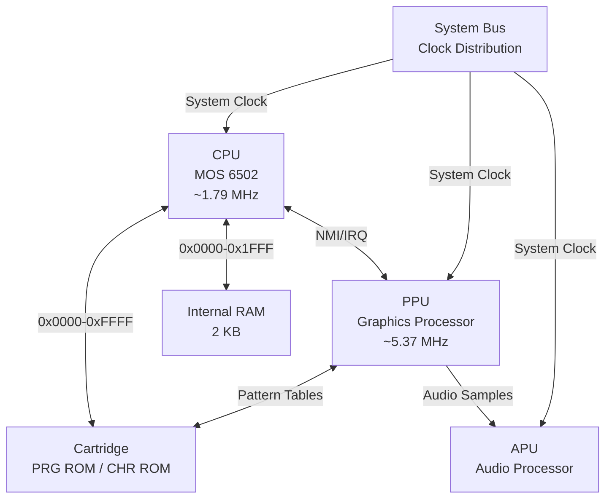
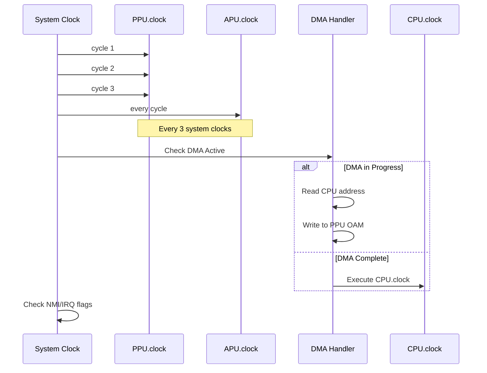
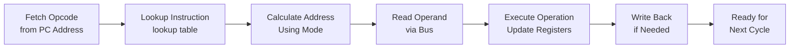
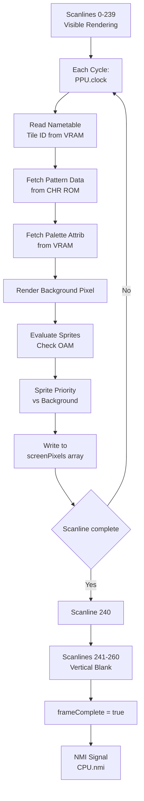
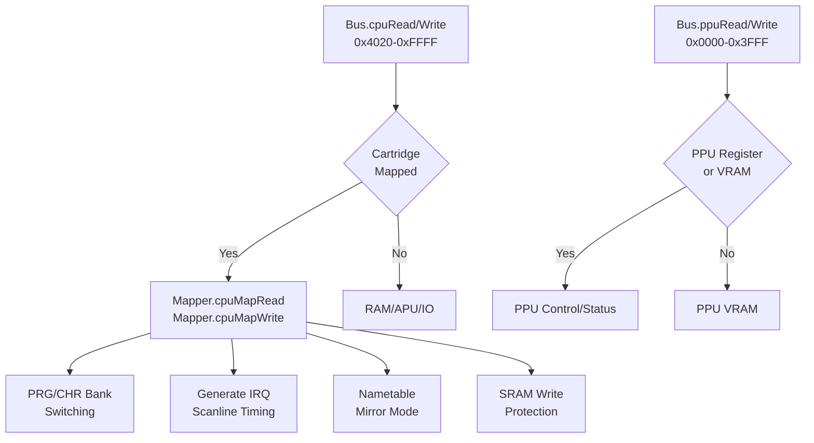
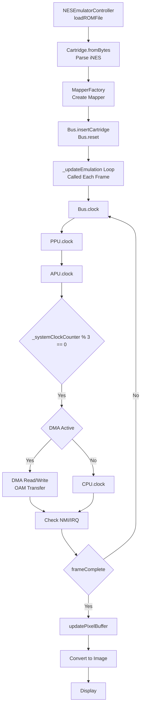
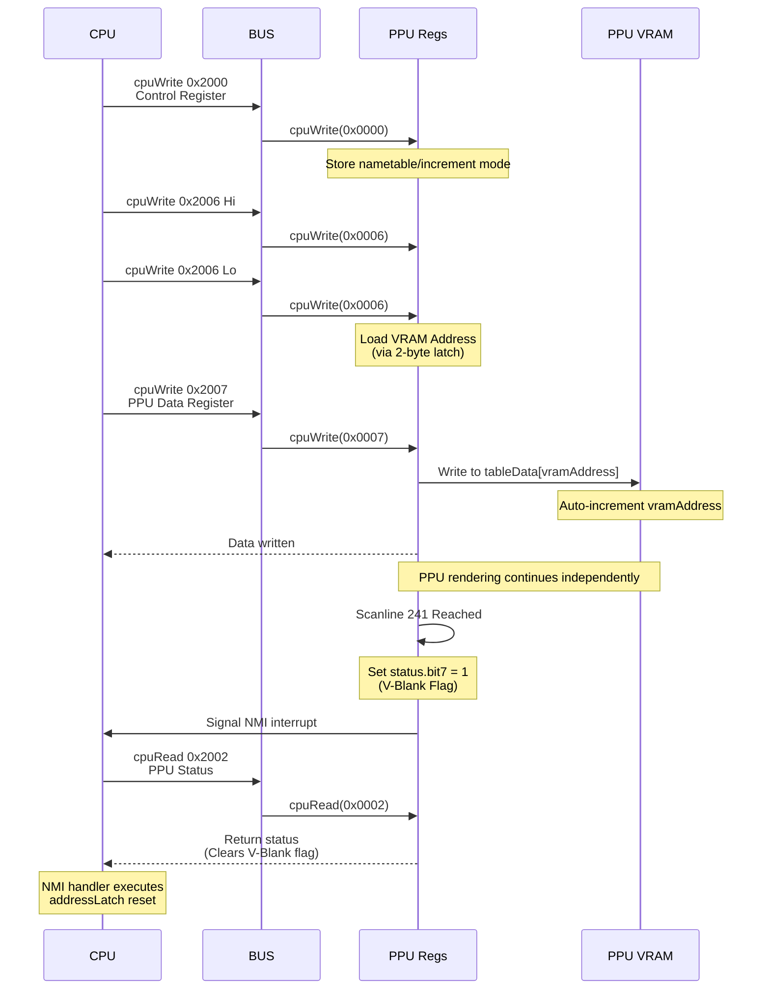

# fnes - A NES Emulator in Dart & Flutter

A cycle-accurate Nintendo Entertainment System emulator written in Dart with a Flutter UI. This emulator faithfully reproduces the hardware behavior of the original NES by implementing the MOS 6502 CPU, PPU graphics processor, APU audio unit, and multiple game cartridge mappers.

## System Architecture

### Hardware Component Overview

The emulator follows the original NES hardware architecture, where all components communicate through a shared memory bus. Each hardware component operates independently on its own clock cycle, synchronized through the main system clock.



### Memory Map

The CPU's 16-bit address space (64 KB) is divided into distinct regions:

```
┌─────────────────────────────────────┐
│ 0x0000 - 0x1FFF (8 KB)              │ Internal RAM (mirrored 4x)
├─────────────────────────────────────┤
│ 0x2000 - 0x3FFF (8 KB)              │ PPU Registers (mirrored)
├─────────────────────────────────────┤
│ 0x4000 - 0x4017 (24 bytes)          │ APU & I/O Registers
├─────────────────────────────────────┤
│ 0x4018 - 0x401F (8 bytes)           │ Test/Expansion Port
├─────────────────────────────────────┤
│ 0x4020 - 0x5FFF (8 KB)              │ Cartridge Expansion ROM
├─────────────────────────────────────┤
│ 0x6000 - 0x7FFF (8 KB)              │ Cartridge SRAM (Battery Backed)
├─────────────────────────────────────┤
│ 0x8000 - 0xFFFF (32 KB)             │ Cartridge PRG ROM
└─────────────────────────────────────┘
```

## Execution Pipeline

### System Clock and Synchronization

The emulator uses a master system clock in `Bus.clock()`. On each call:

1. **PPU cycles 3 times** (5.37 MHz): fetches tiles, patterns, palettes; renders pixels
2. **APU ticks once**: generates audio samples
3. **Every 3 cycles**: CPU executes one instruction (1.79 MHz) OR DMA transfers sprite data
4. **NMI/IRQ check**: interrupts signaled to CPU after clock synchronization

The critical part is the cycle counter `_systemClockCounter % 3`:

- When `_systemClockCounter % 3 == 0` AND no DMA: CPU executes
- When DMA active: CPU stalls, OAM bytes transferred instead
- This matches hardware exactly: CPU waits while PPU uploads sprites via OAM DMA



### Instruction Execution

The CPU executes the standard MOS 6502 instruction set with 151 unique instructions (including unofficial opcodes). Each instruction follows a fixed execution pattern:



The CPU supports 13 addressing modes to access memory:

- Implied (IMP): No operand required
- Accumulator (ACC): Operates on A register
- Immediate (IMM): 8-bit literal value
- Zero Page (ZP0): 8-bit address (low 256 bytes)
- Zero Page X/Y (ZPX/ZPY): Zero page with X or Y offset
- Absolute (ABS): 16-bit address
- Absolute X/Y (ABX/ABY): Absolute with X or Y offset
- Indirect (IND): 16-bit address pointing to another address
- Indirect X (IZX): Zero page address + X, then indirect
- Indirect Y (IZY): Indirect zero page address + Y
- Relative (REL): 8-bit signed offset for branches

## Component Details

### CPU - MOS 6502 Processor

The CPU is the heart of the emulator, executing game logic at approximately 1.79 MHz. It maintains internal state including:

- **Registers**: Accumulator (A), Index X, Index Y, Stack Pointer (SP), Program Counter (PC)
- **Flags**: Carry (C), Zero (Z), Interrupt Disable (I), Decimal (D), Break (B), Overflow (V), Negative (N)
- **Memory Interface**: Connected to the system bus for all memory operations

The CPU handles all game logic execution, including:

- Character movement and collision
- Game state management
- Input processing
- Sprite and background management instructions

### PPU - Picture Processing Unit

The PPU operates at 5.37 MHz (3x CPU) and manages video rendering. Its memory is separate from CPU RAM:

- **Nametable VRAM (2 KB)**: `tableData` - stores tile IDs (256x240 / 8x8 per tile)
- **OAM (256 bytes)**: `pOAM` - sprite metadata (Y pos, tile ID, attrib, X pos per sprite)
- **Pattern Tables (4 KB CHR)**: Fetched from cartridge - bitmap data for 256 unique tiles
- **Palette Tables (32 bytes)**: `paletteTable` - 8 palettes for background, 8 for sprites

The PPU also maintains internal state:

- **Scroll position** (X/Y): via `LoopyRegister` for viewport control
- **Shifters**: `backgroundShifterPatternLow/High`, `backgroundShifterAttribLow/High`
- **Sprite buffers**: `spriteShifterPatternLow/High` for 8 sprites per scanline

#### Rendering Pipeline

The PPU renders the display line-by-line using a scanline-based approach. On each of 262 scanlines (341 cycles per line):

**Visible Scanlines (0-239)**:

- PPU.cycle increments 0-340 each PPU clock
- At cycles 1-256: nametable and pattern data fetching, pixel rendering to `screenPixels[scanline][cycle-1]`
- At cycles 257-320: sprite evaluation and OAM sprite data loading
- At cycles 321-340: prefetch next scanline data

**Post-render & Vblank (240-260)**:

- Scanline 240 is post-render (no rendering)
- Scanlines 241-260 are vblank period
- At start of scanline 241: `status.bit7 = 1` (V-blank flag), then `ppu.nmi = true` signals CPU



The frame is 256 pixels wide by 240 pixels tall, with each pixel taking one PPU cycle to render. The PPU also handles:

- Sprite evaluation (checking which sprites appear on current scanline)
- Sprite priority (background over sprite or vice versa)
- Palette selection (16 colors per palette, 8 palettes available)

#### NMI - Non-Maskable Interrupt

At the start of the vertical blank period (after scanline 240), the PPU signals an NMI to the CPU. This allows the CPU to safely update OAM and VRAM data without causing visual artifacts. The CPU must complete NMI handling before the next visible scanline begins.

### APU - Audio Processing Unit

The APU generates audio by mixing 5 independent channels. Games write to APU registers (0x4000-0x4017) to control sounds:

**5 Audio Channels**:

- **Pulse 1 & 2**: Duty cycle waveforms (12.5%, 25%, 50%, 75%) with frequency control
- **Triangle**: Fixed waveform, 16 levels of volume
- **Noise**: Pseudo-random noise generator with configurable frequencies
- **DMC**: Delta Modulation Channel for sample playback from memory

**Per-Channel Components**:

- **Envelope Generator**: Volume control with start/decay/release
- **Sweeper**: Automatically adjusts frequency (Pulse channels)
- **Length Counter**: Auto-stops when count reaches zero
- **Frame Counter**: Synchronizes envelope/sweep/length updates

The APU.clock() runs once per system cycle. APU samples are collected into `_audioBuffer` and streamed to the Flutter audio output at configurable sample rate.

### Cartridge System

Cartridges contain the game code (PRG ROM) and graphics data (CHR ROM). The `Cartridge` class reads iNES format:

**iNES Header (16 bytes)**:

- Byte 4: PRG ROM size (in 16KB units)
- Byte 5: CHR ROM size (in 8KB units)
- Byte 6-7: Mapper ID (upper/lower nibbles)
- Byte 8: SRAM size / Mirroring mode

**Cartridge stores**:

- `_programMemory`: PRG ROM (program code, 16 KB \* programBanks)
- `_charMemory`: CHR ROM (graphics, 8 KB \* charBanks) OR 8 KB CHR RAM if charBanks == 0
- `_mapper`: Mapper instance for bank switching and advanced features
- `_hwMirror`: Hardware mirroring mode (horizontal/vertical)

#### Cartridge Mirroring

NES cartridges support different mirroring modes for background VRAM:

- **Horizontal**: Left/right tiles mirror vertically (for horizontal scrolling)
- **Vertical**: Top/bottom tiles mirror horizontally (for vertical scrolling)
- **One-Screen Low**: All tiles map to first 1 KB of VRAM
- **One-Screen High**: All tiles map to second 1 KB of VRAM
- **Hardware**: Cartridge controls mirroring (typically used by advanced mappers)

### Mapper Architecture

Mappers are Memory Management Chips that reside on cartridges. They intercept CPU and PPU memory accesses to provide advanced features like:



**Implemented Mappers**:

- **Mapper 000 (NROM)**: Simple no-switching (32 KB max)
- **Mapper 001 (SxROM)**: MMC1 with bank switching and mirroring
- **Mapper 002 (UxROM)**: Simple PRG bank switching
- **Mapper 003 (CNROM)**: CHR bank switching
- **Mapper 004 (TxROM)**: MMC3 with scanline IRQs and advanced banking
- **Mapper 007 (AxROM)**: Single bank switching with mirroring
- **Mapper 066 (GxROM)**: Simple PRG and CHR bank switching

## Emulation Flow

### Main Loop



### Frame Timing

A complete NES frame consists of 262 scanlines (29,781 CPU cycles):

- **Scanlines 0-239**: Visible rendering area (240 lines)
- **Scanline 240**: Post-render line (ignored)
- **Scanlines 241-260**: Vertical blank period (20 lines) - NMI fires at start
- **Scanline 261**: Pre-render line (sprite evaluation setup)

This gives approximately 59.73 frames per second on NTSC systems.

### CPU-PPU Communication

The PPU provides status registers and memory that the CPU accesses via the system bus. Key interactions:



## Code Organization

The project is organized into the following directories:

- **`lib/components/`**: Core hardware components

  - `cpu.dart`: MOS 6502 processor with 151 instructions and full addressing mode support
  - `ppu.dart`: Graphics processor with scanline rendering and sprite evaluation
  - `apu.dart`: Audio processor with 5 sound channels
  - `bus.dart`: System memory bus routing CPU/PPU accesses to appropriate components
  - `cartridge.dart`: iNES ROM parsing and mapper instantiation

- **`lib/mappers/`**: Cartridge mapper implementations for bank switching and advanced features

  - `mapper.dart`: Abstract base class for mapper implementations
  - `mapper_000.dart` through `mapper_066.dart`: Specific mapper implementations
  - `mapper_factory.dart`: Factory for instantiating correct mapper based on ROM

- **`lib/controllers/`**: Emulation control logic

  - `nes_emulator_controller.dart`: High-level emulator state management and input handling

- **`lib/widgets/`**: Flutter UI components for display and debugging
  - Debug panels for CPU state, memory inspection, and palette visualization

## Key Implementation Details

### Cycle-Accurate Timing via Bus.clock()

The `Bus.clock()` method is called repeatedly from `NESEmulatorController._updateEmulation()`. Each call represents one system clock tick:

```
_systemClockCounter % 3:
0: PPU cycle 1, APU cycle, DMA or CPU
1: PPU cycle 2, APU cycle
2: PPU cycle 3, APU cycle
```

The `_dmaTransfer` flag controls whether CPU executes or OAM is transferred. When set by `cpuWrite(0x4014)`, CPU is stalled for ~512 system cycles while `_dmaPage` bytes transfer to PPU.pOAM.

### Bus Memory Routing

All CPU memory access calls `Bus.cpuRead()` / `Bus.cpuWrite()`, which routes to components:

- **0x0000-0x1FFF**: Internal `_cpuRam` (2 KB mirrored at 0x0800, 0x1000, 0x1800)
- **0x2000-0x3FFF**: PPU registers via `ppu.cpuRead/Write(address & 0x0007)` (mirrored)
- **0x4000-0x4013, 0x4015, 0x4017**: APU and APU status
- **0x4016-0x4017**: Controller input strobe/read
- **0x4020-0xFFFF**: Cartridge via `cart.cpuRead/Write()` (mapper decides if valid)

### Interrupt Handling

The Bus checks interrupts after each clock:

- **NMI**: If `ppu.nmi` flag set, calls `cpu.nmi()` (pushes PC and status, jumps to 0xFFFA)
- **IRQ**: If mapper returns `irqState() = true`, calls `cpu.irq()` (jumps to 0xFFFE)

CPU I flag must be clear (not `0x04`) for IRQ to fire. NMI cannot be masked.

### Mapper Interface

All mappers extend abstract class `Mapper`:

```dart
int? cpuMapRead(int address)  // Returns ROM offset or null
int? cpuMapWrite(int address, int data)  // Handles bank switches
int? ppuMapRead(int address)  // Returns CHR ROM offset
int? ppuMapWrite(int address)  // Detects CHR writes (for MMC5, etc)
```

The Bus checks mapper first for 0x4020-0xFFFF range before defaulting to internal RAM.

### PPU Register Semantics

PPU registers map at 0x2000-0x3FFF (mirrored every 8 bytes):

- **0x2000**: Control (nametable select, increment, NMI enable)
- **0x2001**: Mask (rendering enable, sprite/BG visibility)
- **0x2002**: Status (V-blank, sprite0 hit, sprite overflow) - read clears latch
- **0x2003**: OAM Address (which sprite to access)
- **0x2004**: OAM Data (read/write current sprite)
- **0x2005**: Scroll X/Y (write twice: X then Y)
- **0x2006**: VRAM Address (write twice: Hi then Lo)
- **0x2007**: VRAM Data (reads/writes nametable, palette, or CHR)

## Screenshots

|                                                 |                                                 |
| :---------------------------------------------: | :---------------------------------------------: |
|  |  |
|  |  |
|  |  |

## Demo

You can see a live demo of the emulator running in the browser here:
[https://hamed-rezaee.github.io/fnes/](https://hamed-rezaee.github.io/fnes/)

## Getting Started

1.  **Clone the repository:**
    ```sh
    git clone https://github.com/hamed-rezaee/fnes.git
    ```
2.  **Navigate to the project directory:**
    ```sh
    cd fnes
    ```
3.  **Install dependencies:**
    ```sh
    flutter pub get
    ```
4.  **Run the app:**
    ```sh
    flutter run
    ```

## License

This project is licensed under the MIT License - see the [LICENSE](LICENSE) file for details.
